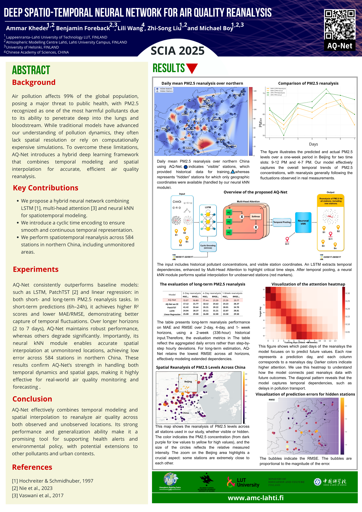

<h1 align="center">🌫️ AQ-Net</h1>
<h3 align="center">Deep Spatio-Temporal Neural Network for Air Quality Reanalysis</h3>

<p align="center">
  <strong>Accepted at SCIA 2025</strong> • <a href="https://arxiv.org/abs/2502.11941">arXiv:2502.11941</a> • <a href="img/poster%20SCIA%202025V.pdf">Poster (PDF)</a>
</p>

<p align="center">
  <a href="img/poster%20SCIA%202025V.pdf">
    
  </a>
</p>

---

## 🚀 Why AQ-Net?

> "Predicting pollution where no sensors dare to go" — by combining deep learning with geospatial interpolation.

Cities around the world suffer from **partial or uneven sensor coverage**. AQ-Net bridges this gap using:
- 📈 LSTM & Attention for **temporal learning**
- 🗺 Neural kNN for **spatial interpolation**
- 🌀 Cyclic Encoding for **continuous time awareness**

---

## 🌍 Visualizing Pollution Across China

<p align="center">
  
  
</p>

This view highlights pollution hotspots, learned relationships between stations, and the ability to reanalyze data at **unmonitored locations**.

---

## 🧠 Core Ideas

### ⏳ 1. Time-aware Encoding
- LSTM + Multi-Head Attention to capture long-term dependencies.
- Cyclic Encoding to project discrete time into continuous space.

### 🌐 2. Spatial Interpolation
- A learnable neural kNN module maps temporal features to spatial gaps.

### 🧪 3. Real-world Evaluation
- Trained on 2013–2017 data in Northern China
- Robust across **short-term (6–24h)** and **long-term (2–7 days)** windows

---

## 🧬 Architecture Diagram

<p align="center">
  
</p>

---

## 📊 Results Summary

- Compared to LSTM, Linear Regression, and PatchTST
- **Significant improvement** in:
  - MAE
  - RMSE
  - R²
- Generalizes well to **hidden stations**

<p align="center">
  
</p>

---

## 🛠️ Installation

```bash
git clone https://github.com/AmmarKheder/AQ-Net.git
cd AQ-Net
pip install -r requirements.txt
python main.py
